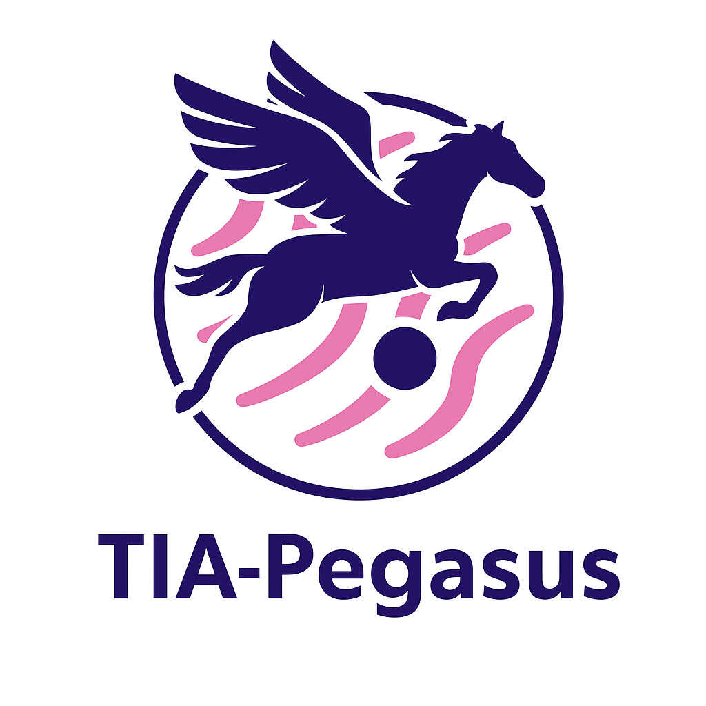

<p align="center">
  
</p>

# CHIMERA-Challenge

This repository is part of the TIA-Pegasus submission for the CHIMERA Challenge.

# AS Scripts
My scripts require Python 3.11 along with:
tiatoolbox, pyradiomics, simpleitk, scikit-learn

- extract_radiomic_feature.py - used to extract radiomic features
- survival prediction - survival prediction via stratified 5-fold cross-validation using clinical, radiomic and both sets of features combined

## 📊 Best Performance Summary

### 🔍 Selected Features

```json
{
  "Clinical Only": [
    "age_at_prostatectomy",
    "primary_gleason",
    "secondary_gleason",
    "ISUP",
    "pre_operative_PSA",
    "positive_surgical_margins"
  ],
  "Radiomics Only": [
    "total_volume_mm3",
    "avg_intensity_adc",
    "avg_intensity_hbv",
    "avg_intensity_t2w"
  ],
  "Combined Features": [
    "total_volume_mm3",
    "avg_intensity_adc",
    "avg_intensity_hbv",
    "avg_intensity_t2w",
    "age_at_prostatectomy",
    "primary_gleason",
    "secondary_gleason",
    "ISUP",
    "pre_operative_PSA",
    "positive_surgical_margins"
  ]
}
```
### 📈 Fold-wise Performance

| Fold     | Clinical Only | Radiomics Only | Combined Features |
|----------|----------------|----------------|-------------------|
| Fold 1   | 0.724          | 0.592          | 0.724             |
| Fold 2   | 0.637          | 0.582          | 0.473             |
| Fold 3   | 0.782          | 0.782          | 0.756             |
| Fold 4   | 0.587          | 0.413          | 0.587             |
| Fold 5   | 0.845          | 0.563          | 0.761             |
| **Average** | **0.715**      | **0.587**      | **0.660**         |
